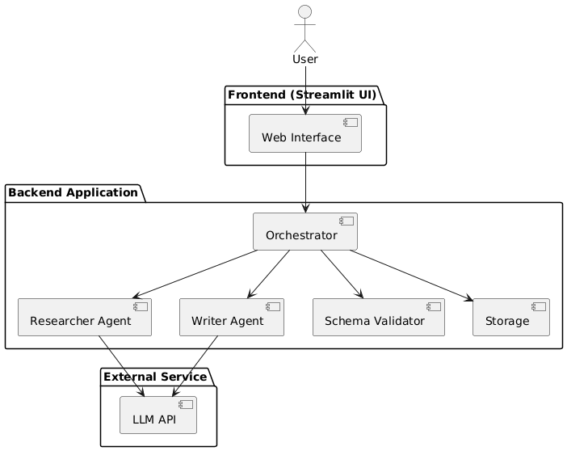

# Multi-Agent Manufacturing System

A role-based multi-agent system that automates supplier sourcing and generates structured comparison reports using LLM-powered agents.

This project demonstrates agent specialization, controlled hand-offs, schema validation, state management, and workflow orchestration using **Python + CrewAI + LLM APIs**.

---

## Problem Statement

Design and implement a collaborative Manufacturing Agent architecture featuring specialization and structured hand-off protocols.

The system consists of:

* **Researcher Agent** → Collects supplier information
* **Writer Agent** → Synthesizes and formats structured comparison reports
* **Orchestrator** → Controls execution flow and state management

The goal is to produce high-quality, structured outputs from complex sourcing queries.

---

## System Overview

The system follows a layered architecture:

```
User → Streamlit UI → Orchestrator
                   → Researcher Agent → LLM API
                   → Writer Agent     → LLM API
                   → Storage + Schema Validation
```

### Agent Roles

#### Researcher Agent

* Interprets supplier sourcing queries
* Identifies potential suppliers
* Extracts supplier attributes
* Outputs structured raw JSON

#### Writer Agent

* Cleans and normalizes supplier data
* Generates structured comparison tables
* Ranks suppliers
* Produces executive summary report

#### Orchestrator

* Creates session/run ID
* Executes agents sequentially
* Validates schema between stages
* Stores artifacts
* Returns final results to UI

---

## User Interface Flow

The application follows a gated interaction flow to ensure secure API usage.

### Step 1 – Enter API Key

When the application loads:

* User selects LLM Provider (Gemini)
* User enters API Key
* User selects Model (default: `gemini/gemini-2.5-flash`)
* Optional: Enable Verbose Logs

Until a valid API key is entered, the sourcing form remains hidden.

---

### Step 2 – Manufacturing Sourcing Query

After entering the API key, the **Manufacturing Sourcing Query** panel becomes visible.

The form includes pre-filled default values which can be modified:

| Field                | Default Value     |
| -------------------- | ----------------- |
| Process              | Injection Molding |
| Materials            | ABS               |
| Location Preference  | India             |
| Monthly Capacity Min | 50000             |
| Certifications       | ISO 9001          |

Users can modify these values before clicking **Run Agents**.

The system converts these structured inputs into a sourcing query for the Researcher Agent.

---

## Architecture Diagram



---

## Workflow

1. User opens the application
2. User enters LLM API Key in the sidebar
3. Manufacturing Sourcing Query form becomes visible
4. User reviews or edits pre-filled sourcing parameters
5. User clicks "Run Agents"
6. Researcher Agent generates raw supplier dataset
7. Schema validation occurs
8. Writer Agent generates structured comparison report
9. Artifacts stored
10. UI displays final output

---

## Project Structure

```
Multi-agent-system/
│
├── agents.py          # Agent definitions
├── orchestrator.py    # Workflow controller
├── tasks.py           # Task definitions
├── schemas.py         # JSON validation models
├── storage.py         # File-based persistence
├── frontend.py        # Streamlit UI
├── requirements.txt
└── artifacts/         # Generated run outputs
```

---

## Sample Output Artifacts

Each run generates:

```
artifacts/
  run_YYYYMMDD_HHMMSS/
    raw_suppliers.json        # Researcher output
    structured_suppliers.json # Writer normalized output
    report.md                 # Final comparison report
    state.json                # Workflow state tracking

```

---

## Tech Stack

* Python 3.10+
* CrewAI
* Gemini / LLM API
* Streamlit
* Pydantic (Schema Validation)

---

## 🛠 Installation

### 1️⃣ Clone the Repository

```bash
git clone https://github.com/omtiwari17/Multi-agent-system.git
cd Multi-agent-system
```

### 2️⃣ Create Virtual Environment

```bash
python -m venv venv
venv\Scripts\activate   # Windows
```

### 3️⃣ Install Dependencies

```bash
pip install -r requirements.txt
```

---

## Environment Setup

Create a `.env` file:

```
CREWAI_DISABLE_TELEMETRY=true
```
# API key is entered through the Streamlit UI (not stored in .env)

---

## Running the Application

```bash
streamlit run frontend.py
```

Open the browser at:

```
http://localhost:8501
```

---

## Example Query

Default UI Configuration Example:

* Process: Injection Molding
* Materials: ABS
* Location: India
* Minimum Monthly Capacity: 50,000 units
* Certifications: ISO 9001

Output:

* Ranked supplier list
* Comparison table
* Risk and gap analysis
* Executive summary

---

## Design Highlights

✔ Role-based agent specialization
✔ JSON-based structured handoffs
✔ Schema validation between stages
✔ Run-based artifact storage
✔ Clear separation of concerns
✔ Extensible architecture for additional agents

---

## Future Enhancements

* Add Compliance Agent
* Add RFQ Generator Agent
* Add Negotiation Strategy Agent
* Integrate vector database (RAG)
* Deploy backend as REST API
* Add Docker containerization
* Add caching layer
* Add rate-limit fallback logic

---

## Non-Functional Considerations

* Session isolation
* Controlled retries for LLM errors
* No API key persistence
* Deterministic workflow states
* Structured artifact logging
* API key is session-based and not stored on disk
* Query form remains hidden until valid API key is provided

---

## Development Goals

This project demonstrates:

* Multi-agent orchestration
* LLM workflow engineering
* State management
* Structured output enforcement
* Practical AI system design

---

## Authors

* Om Tiwari 
* Paridhi Shirwalkar 
* Nitesh Chourasiya 
* Mradul Jain 
